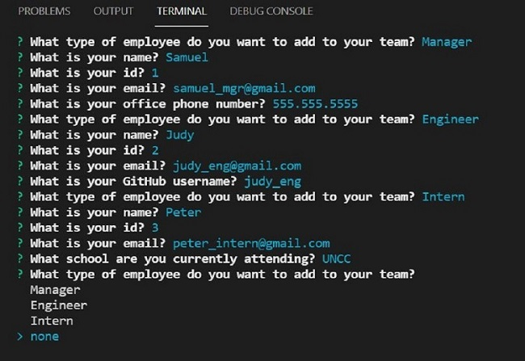

# team-profile-generator
Team Profile Generator

## Description
Designed a note taker application using Express.js that allows user to save important tasks to remember to complete at a later time.

## Table Of Contents
[Links](#links)

[Installation](#installation)

[Instructions](#instructions)

[Usage](#usage)

[Tests](#tests)

[Screenshots](#screenshots)

[License](#license)

## Links
[GitHub Repo](https://github.com/asantercureton/note-taker-app)

[Walkthrough: Prompts](https://watch.screencastify.com/v/15FnHhkfObTCqrxJVJEw)

[Walkthrough: Test Passed](https://watch.screencastify.com/v/GlPjXp6tqQXHIS0Qi7tB)

## Installation
Run "npm install" at root directory.

## Instructions
Run "node index.js" to intiate the command-line applicaiton and begin adding Employees to your team. Once all team members are added, select "none" and your team will be displayed on a styled HTML file displaying the inputted information.

## Usage
Designed a Node.js command-line application that takes in information about employees on a software engineering team, then generates an HTML webpage that displays summaries for each person. 

## Tests
Run "npm install --save-dev jest" at root directory.
Run "npm run test" to execute all tests.

## Screenshots
Below is a screenshot of the project:

| RUNNING THE COMMAND-LINE PROMPTS

----
| PASSED TESTS

## License

---
© 2021 Team Profile Generator.